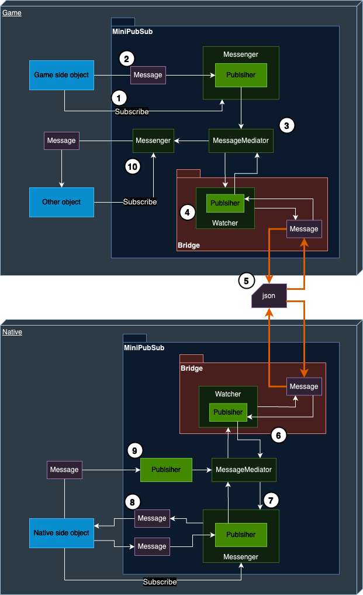

# MiniPubSub

## 개요
유니티 혹은 언리얼 엔진이 안드로이드/iOS 의 특정 기능에 대한 인터페이스가 없거나, 안드로이드/iOS 용으로만 만들어진 SDK 를 사용하려면  
jni 혹은 jni 래퍼 클래스를 사용하거나(안드로이드) c 라이브러리를 직접 연동(iOS)해야 합니다.  
MiniPubSub은 유니티/언리얼 엔진과 네이티브 sdk 사이에 통일된 인터페이스를 가진 통신 모듈로, 모바일 sdk들을 게임과 더 쉽고 빠르게 통합 할 목적으로 만들었습니다.  

## 구조
<!--  -->


### 흐름
1. Messenger 객체에 특정 키에 대해 Subscribe 를 하여 Message를 수신하도록 설정합니다.
2. MiniPubSub 바깥 게임 혹은 네이티브에서는 Message 객체를 사용해 데이터를 주고 받습니다.
3. MiniPubSub 내부에 도착한 메세지는 MessageMediator 가 적절한 Messener 혹은 Watcher 에게 분배합니다.
4. Watcher 는 발생한 모든 메세지를 열람할 수 있는 특수한 개체입니다. 모든 메세지를 받아 네이티브로 보낼 준비를 합니다.
5. Bridge는 메세지를 json 형태로 가공해 네이티브의 Bridge 에 전달합니다.
6. 네이티브 Bridge 는 다시 메세지 객체로 변환해 MessageMediator 에게 전달합니다.
7. MessageMediator 는 적절한(즉 해당 메세지의 키를 구독한) Messenger들에게 분배합니다.
8. Subscribe를 수행한 Messenger 객체로부터 메세지를 전달받습니다.
9. Publisher(수신 불가 객체) 를 통해 메세지 전달만을 할 수도 있고
10. 다른 Messenger 객체를 통해서 메세지를 전달 받을 수도 있습니다.

### Message 구조
구현의 목표는 언리얼 개발자는 c++ 인터페이스만, 안드로이드 개발자는 kotlin 인터페이스만 수정할 수 있게끔 하는것을 목표로 합니다.  
이를 위해 message라는 데이터 전달 목적의 클래스를 만들었고 이는 다음과 같은 json 구조로 변환되어야 합니다.
```json
{
    "key": "Initialize",
    "Data": {
        "host": "example.com",
        "id": "adcd",
        "whitelist": [
            "aaaa",
            "bbbb",
            "cccc"
        ]
    }
}
```
Data 키의 값에 해당하는 부분은 json으로 구조화 할 수 있는 형태면 어떤 것이든 받을 수 있도록 하여, 외부에서 Message를 수정하지 않고 데이터를 구성할 수 있게 하였습니다.  
데이터의 구조에 상관없이 MiniPubSub은 Message 타입을 다룰 수 있게 했고, 데이터의 캐스팅은 사용자의 책임하에 이루어지도록 구성되었습니다.
#### Unity (C#)
데이터를 object 타입으로 처리
#### Unreal (C++)
키만 저장한 FMessage, 키와 데이터 모두 저장한 TMessage를 따로 구현하였습니다.  
외부에선 TMessage를 통해서 메세지를 생성하고 MiniPubSub 내부에선 FMessage 를 사용하도록 구현했습니다.  
다음의 이유로 기본생성자와 복사 생성자 등은 private나 protected로 선언했고 생성용 혹은 캐스팅용 함수를 따로 제공했습니다.
- 셰어드 포인터로만 Message 객체를 생성하여, 복사 오버헤드 방지 및 Message 내부에서 관리하는 포인터를 안전하게 제어하기 위해
- 잘못된 캐스팅(원래 FMessage 였던 객체를 TMessage로 변환 등)의 실수 방지

FMessage는 키와 FJsonValue 타입으로 관리되는 데이터가 있습니다.
- 위에서 정의한 message 형태의 json을 파싱하여 Data 영역은 FJsonValue에 저장합니다.
- FJsonValue 는 추후 TMessage 로 캐스팅 시 DataType* 타입으로 다시 변경됩니다.
```cpp
// FMessage
struct MINIPUBSUB_API FMessage
{
public:
	const EMessageType MessageType;  
	const FString Key;
	
protected:
	const TSharedPtr<FJsonValue> DataJson;

// private & protected constructors

public:
	virtual ~FMessage(){};
	virtual FString ToString() const{return Key;}

	static TSharedPtr<const FMessage> Create(const FString& Key)
	{
		// create FMessage
	}

	static TSharedPtr<const FMessage> ParseFrom(const FString& Json)
	{
		// Json string to FMessage
	}
};
```

TMessage는 템플릿 타입으로 데이터는 UStruct인 DataType의 형태를 받습니다.
- TMessage::Convert를 통해 FMessage 타입이었던 TMessage를 다시 TMessage로 전환합니다.
```cpp
// TMessage
template<typename DataType>
struct MINIPUBSUB_API TMessage final :  FMessage
{
private:
	DataType *DataPtr;

    // default constructor...

	explicit TMessage(const FMessage& Message)
	:FMessage(Message)
	{
		// if DataJson's type EJson::Object, Deserializing as 'DataType' excuted
	}
	
public:
	virtual ~TMessage() override
	{
		delete DataPtr;
	}

	const DataType& Data() const
	{
		return *DataPtr;
	}
	
	virtual FString ToString() const override
	{
        // Message to json string
	}

	static TSharedPtr<const TMessage> Create(const FString& Key, const DataType& Data)
	{
		// Create TMessage
	}
	
	static TSharedPtr<const TMessage> Convert(const TSharedPtr<const FMessage>& MessagePtr)
	{
		check(MessagePtr.IsValid())
		// if message's original type is TMessage, static cast called  
		if(MessagePtr->MessageType == EMessageType::TMessage)
			return StaticCastSharedPtr<const TMessage>(MessagePtr);
		// If message' original type is FMessage, data is Deserialized from FMessage::DataJson
		return MakeShareable(new TMessage(*MessagePtr));
	}
};
```
#### Android (kotlin)
데이터를 Any 타입으로 처리
#### iOS (swift)
Any 타입의 데이터를 받아 [string: Any] 타입의 딕셔너리에 data 저장.  
키와 데이터 각각에 읽기 전용 프로퍼티를 통해 접근할 수 있도록 했습니다.  
Codable이나 Generic 은 아래의 이유로 사용할 수 없었습니다.
- 데이터를 Codable로 선언하는 것은 불명확한 타입으로 선언하는 것으로 Codable 프로토콜을 준수하지 못함
- Generic 을 사용할 경우 데이터 타입에 따라 MiniPubSub 내부 코드가 변경할 수 밖에 없었음

따라서 [String: Any] 타입의 형태로 json 전환이 가능한 JSONSerialization api 를 활용했습니다. 
```swift
public class Message{
    
    private let dic: [String: Any]
    
    init(withData data: Data){
        self.dic = (try? JSONSerialization.jsonObject(with: data) as? [String: Any]) ?? [:]
    }
    
    func serialize() -> Data?{
        try? JSONSerialization.data(withJSONObject: self.dic)
    }
    
    public init(key: String, data: Any){
        self.dic = [
            "Key" : key,
            "Data" : data
        ]
    }
    public var key: String?{
        get{
            dic["Key"] as? String
        }
    }
    
    public var data: Any?{
        get{
            dic["Data"]
        }
    }
    
}
```

## 외부 공개 클래스

### Message
데이터를 주고받기 위해 사용하는 객체.
- 키 : 해당 메세지의 키. 사전에 해당 키에 Subscribe 한 Messenger 객체는 해당 메세지를 수신할 수 있습니다.
- 데이터 : json 으로 구조화 할 수 있는 형식의 데이터 객체. 다른 수신자에게 전달하고자 하는 내용입니다.  

### Publisher
메세지를 송신 할 수 있지만 수신은 불가능한 객체입니다.  
Messenger 와 Watcher 객체는 내부에 Publisher 객체를 소유하고 있습니다.
- Publish() : 메세지를 전송합니다.
```cs
// unity sample
Messenger messenger = new Messenger();
InitData data = new InitData{
    //...
};
messenger.Publish("Initialize", data);
```
### Messenger
메세지를 송수신할 수 있는 객체입니다.
- Subscribe() : 키를 등록하여 해당 키와 같은 메세지를 받습니다.
- Unsubscribe() : 해당 키에 대한 구독을 종료합니다.
- Publish() : 메세지를 전송합니다.
```cpp
// unreal sample
FMessenger Messenger = FMessenger();

Messenger.Subscribe(TEXT("InitResult"), FReceiveDelegate::CreateLambda([](TSharedPtr<const FMessage> Message)
{
    TSharedPtr<const TMessage<FTest>> ResultMessage = TMessage<FResult>::Convert(Message);
    // handle ResultMessage...
}));

// ...
Messenger.Unsubscribe(TEXT("InitResult"));
```

### Watcher
발생하는 모든 메세지를 수신하는 객체.  
Watcher를 통해 발생한 모든 메세지를 엔진과 네이티브 사이에 전달합니다.
- Watch() : 발생한 모든 메세지를 수신합니다.
- Unwatch() : 메세지 수신을 종료합니다.
```java
val watcher = Watcher()
watcher.watch{ message ->
    // handle message
}
```

## 프로젝트 링크
- Unity : [https://github.com/minisdk/MiniPubSub-Unity/tree/dev/0.1.1/Packages/MiniPubSub](https://github.com/minisdk/MiniPubSub-Unity/tree/dev/0.1.1/Packages/MiniPubSub)
- Unreal : [https://github.com/minisdk/MiniPubSub-Unreal/tree/dev/0.1.0/Plugins/MiniPubSub](https://github.com/minisdk/MiniPubSub-Unreal/tree/dev/0.1.0/Plugins/MiniPubSub)
- Android : [https://github.com/minisdk/MiniPubSub-Android/tree/dev/0.1.1](https://github.com/minisdk/MiniPubSub-Android/tree/dev/0.1.1)
- iOS : [https://github.com/minisdk/MiniPubSub-iOS/tree/dev/0.1.1](https://github.com/minisdk/MiniPubSub-iOS/tree/dev/0.1.1)