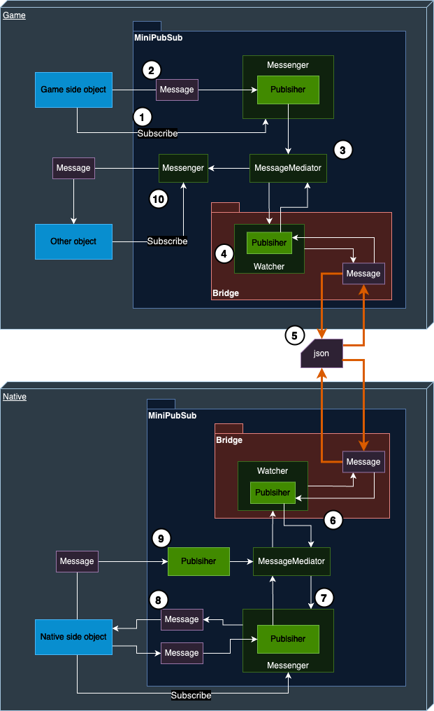

# MiniPubSub

## 개요
유니티 혹은 언리얼 엔진이 안드로이드/iOS 의 특정 기능에 대한 인터페이스가 없거나, 안드로이드/iOS 용으로만 만들어진 SDK 를 사용하려면  
jni 혹은 jni 래퍼 클래스를 사용하거나(안드로이드) c 라이브러리를 직접 연동(iOS)해야 합니다.  
MiniPubSub은 유니티/언리얼 엔진과 네이티브 sdk 사이에 통일된 인터페이스를 가진 통신 모듈로, 모바일 sdk들을 게임과 더 쉽고 빠르게 통합 할 목적으로 만들었습니다.  

## 구조

<!--  -->

### 흐름
1. Messenger 객체에 특정 키에 대해 Subscribe 를 하여 Message를 수신하도록 설정합니다.
2. MiniPubSub 바깥 게임 혹은 네이티브에서는 Message 객체를 사용해 데이터를 주고 받습니다.
3. MiniPubSub 내부에 도착한 메세지는 MessageMediator 가 적절한 Messener 혹은 Watcher 에게 분배합니다.
4. Watcher 는 발생한 모든 메세지를 열람할 수 있는 특수한 개체입니다. 모든 메세지를 받아 네이티브로 보낼 준비를 합니다.
5. Bridge는 메세지를 json 형태로 가공해 네이티브의 Bridge 에 전달합니다.
6. 네이티브 Bridge 는 다시 메세지 객체로 변환해 MessageMediator 에게 전달합니다.
7. MessageMediator 는 적절한(즉 해당 메세지의 키를 구독한) Messenger들에게 분배합니다.
8. Subscribe를 수행한 Messenger 객체로부터 메세지를 전달받습니다.
9. Publisher(수신 불가 객체) 를 통해 메세지 전달만을 할 수도 있고
10. 다른 Messenger 객체를 통해서 메세지를 전달 받을 수도 있습니다.

### Message 구조
구현의 목표는 언리얼 개발자는 c++ 인터페이스만, 안드로이드 개발자는 kotlin 인터페이스만 수정할 수 있게끔 하는것을 목표로 합니다.<br>
이를 위해 message라는 데이터 전달 목적의 구조체를 만들었고 이는 두개의 부분으로 나누어 집니다.
#### info
데이터 전달을 어디로 해야 하는지에 대한 메타데이터를 담고 있습니다.
- nodeInfo: 데이터 발송 주체에 대한 정보
- topic: 데이터 전달 목표 식별 정보
- replyTopic: 결과를 반환 목표 식별 정보
```json
{
	"nodeInfo": {
		"messageOwnerId": 1,
		"publisherId": 3
	},
	"topic": {
		"key": "EXAMPLE",
		"target": 0
	},
	"replyTopic": {
		"key": "EXAMPLE_id1",
		"target": 1
	}
}
```
#### payload
json으로 변환된 데이터가 저장됩니다.<br>
json으로 구조화 할 수 있는 형태면 어떤 것이든 받을 수 있도록 하여, 외부에서 Message나 Playload를 수정하지 않고 데이터를 구성할 수 있게 하였습니다.<br>
데이터의 구조에 상관없이 MiniPubSub은 Message 타입으로 관리되며, 데이터의 캐스팅은 사용자의 책임하에 이루어지도록 구성되었습니다.

#### Unity (C#)
데이터를 object 타입으로 처리합니다.

#### Unreal (C++)
데이터 객체를 json으로 변환하는 헬퍼 함수를 제공합니다. 데이터 객체는 FJsonSerializable 을 상속 받거나 FJsonObject 객체여야 합니다.
- `static FPayload FromJsonSerializable(DataType Data)`
- `static FPayload FromJsonObject(const TSharedRef<FJsonObject>& JsonObject)`

#### Android (kotlin)
데이터를 Any 타입으로 처리합니다.

#### iOS (swift)
데이터를 Codable 객체로 처리합니다.

## 외부 공개 클래스

### Message
데이터를 주고받기 위해 사용하는 객체.
- 키 : 해당 메세지의 키. 사전에 해당 키에 Subscribe 한 Messenger 객체는 해당 메세지를 수신할 수 있습니다.
- 데이터 : json 으로 구조화 할 수 있는 형식의 데이터 객체. 다른 수신자에게 전달하고자 하는 내용입니다.

### Publisher
메세지를 송신 할 수 있지만 수신은 불가능한 객체입니다.  

- Publish() : 메세지를 전송합니다.
```cs
// unity sample
Messenger messenger = new Messenger();
InitData data = new InitData{
    //...
};
messenger.Publish("Initialize", data);
```
### Messenger
메세지를 송수신할 수 있는 객체입니다.<br>
Messenger 객체는 Publisher 객체를 상속하고 있습니다.
- Subscribe() : 키를 등록하여 해당 키와 같은 메세지를 받습니다.
- Unsubscribe() : 해당 키에 대한 구독을 종료합니다.
- Publish() : 메세지를 전송합니다.
- SendSync() : 메세지를 동기적으로 전달하고 결과(Payload)를 반환받습니다.
```cpp
// unreal sample
FMessenger Messenger = FMessenger();

Messenger.Subscribe(TEXT("InitResult"), FReceiveDelegate::CreateLambda([](const FMessage& Message)
{
    FMyWorldData Data = Message.ToJsonSerializable<FMyWorldData>();
    // handle ResultMessage...
}));

// ...
Messenger.Unsubscribe(TEXT("InitResult"));
```

### Watcher
발생하는 모든 메세지를 수신하는 객체.<br>
Watcher를 통해 발생한 모든 메세지를 엔진과 네이티브 사이에 전달합니다.
- Watch() : 발생한 모든 메세지를 수신합니다.
- Unwatch() : 메세지 수신을 종료합니다.
```java
val watcher = Watcher()
watcher.watch{ message ->
    // handle message
}
```

## 프로젝트 링크
- [Unity](https://github.com/minisdk/MiniPubSub-Unity)
- [Unreal](https://github.com/minisdk/MiniPubSub-Unreal)
- [Android](https://github.com/minisdk/MiniPubSub-Android)
- [iOS](https://github.com/minisdk/MiniPubSub-iOS)
